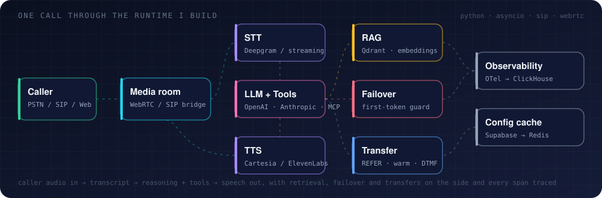

 

 

 

## Right now

**Senior AI Engineer at TriFusionTech.** I own the Python runtime behind a multi-tenant voice-AI platform: autonomous phone agents that answer, route, and resolve live customer calls, running across **600+ production agents**. I own it from the first audio frame to the SIP transfer that hands the caller to a human, plus the RAG stack, Redis cache layer, observability, and the Next.js dashboards and public API around it.

Before that: ELT pipelines on Azure Data Factory, a video-intelligence pipeline on Gemini and Grounding DINO, and real-time inference APIs on AWS SageMaker.

<table>
<tr>
<td width="33%" valign="top">

### 🎙️ Voice runtime
- Streaming STT → LLM → TTS pipeline (Python, LiveKit Agents)
- Turn-taking, barge-in, endpointing, DTMF
- Blind + warm transfers over **SIP REFER**, REFER+Replaces, DTMF confirm, BLF checks
- Answering-machine + IVR detection for outbound
- Screen sharing into multimodal LLM calls

</td>
<td width="33%" valign="top">

### 📚 Retrieval & reliability
- Ingestion worker: S3 → MinerU → chunking → embeddings → **Qdrant**
- In-call retriever with query rewriting, per-KB isolation
- Fallback chains across OpenAI, Anthropic, xAI, Deepgram, Cartesia, ElevenLabs
- First-token stall guard that fails over mid-turn
- Supabase → **Redis** config cache with realtime sync

</td>
<td width="33%" valign="top">

### 🧩 Platform & product
- In-call payments on **Stripe Connect** with idempotency + guardrails
- Tool integrations: calendars, PBX SMS, webhooks, **MCP** servers, ERPs
- **OpenTelemetry → ClickHouse** metrics, cost and usage per org
- Next.js 15 dashboards, public v1 REST API, feature gating
- 130+ pytest modules incl. LLM-judged behavioral tests

</td>
</tr>
</table>

 

## Featured projects

| Project | What it shows | Stack |
| --- | --- | --- |
| [**luma-bistro-livekit-voice-agent**](https://github.com/ZaafirRizwan/luma-bistro-livekit-voice-agent) | Browser voice call with streaming STT/TTS, interruption-aware turns, and guarded, idempotent reservation tools | `LiveKit` `Deepgram Flux` `Cartesia` `FastAPI` |
| [**mini-agentic-rag-system**](https://github.com/ZaafirRizwan/mini-agentic-rag-system) | Agentic RAG with graph-style retrieval, custom tools, memory, and multi-step execution | `LangGraph` `Python` |
| [**Rag_log_analysis**](https://github.com/ZaafirRizwan/Rag_log_analysis) | Hybrid BM25 + FAISS retrieval with self-corrective query rewriting over logs | `Gemini` `FAISS` `Flask` |
| [**resume-fit**](https://github.com/ZaafirRizwan/resume-fit) | Resume-to-job match scoring with skill-gap analysis, shipped as a full product | `FastAPI` `React` `PostgreSQL` `Celery` |
| [**Inventory_Monitoring…Sagemaker**](https://github.com/ZaafirRizwan/Inventory_Monitoring_at_Fullfillment_Centers_using_Sagemaker) | Item-counting pipeline with deep learning and real-time inference endpoints | `SageMaker` `PyTorch` |
| [**Predict-Bike-Sharing-Demand**](https://github.com/ZaafirRizwan/Predict-Bike-Sharing-Demand-with-AutoGluon) | Demand-forecasting regression with AutoML and automated hyperparameter tuning | `AutoGluon` |

 

## Stack

**Voice & agents** 

**Data & retrieval** 

**Languages & web** 

**Infra & observability** 

 

## How I think

> Users judge an AI product in the second after they stop talking or press enter. Everything I build serves that moment: streaming everywhere, failover before silence, tools that fail closed, and telemetry on every span so the next incident is a query, not a guess.

- **Production over demo.** Idempotency keys, guardrails, and audit rows are part of the feature, not follow-ups.
- **Measure, don't assume.** Model capabilities, latencies, and provider quirks get tested, then recorded.
- **Tests that would catch the bug.** Mutation-check the test before trusting it.
- **Own the whole path.** Runtime, retrieval, dashboards, API, and docs, so the seams don't leak.

 

  

### Building agents, retrieval, voice, or data systems that have to work at 3 a.m.? Let's talk.

 

