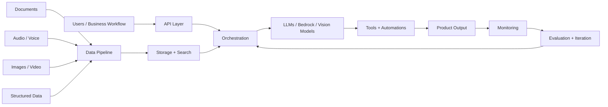

<div align="center">

# Zaafir Rizwan

### Building AI, data, cloud, and automation systems from idea to production

I build practical software across **AI applications, data pipelines, voice automation, computer vision, image generation, cloud infrastructure, and backend systems**.

[](https://linkedin.com/in/zaafir-rizwan)
[](mailto:zaafir.rizwan@gmail.com)
[](https://zaafir-rizwan.tech)

</div>

---

```txt
SYSTEM PROFILE
────────────────────────────────────────────────────
Name        Zaafir Rizwan
Focus       AI Apps · Data Engineering · Cloud · Automation
Builds      Intelligent systems that connect models, data, APIs, and users
Stack       Python · FastAPI · AWS · Bedrock · LangGraph · Data Pipelines
Direction   Product-minded engineering across modern AI and cloud workflows
────────────────────────────────────────────────────
```

## What I build

I work across the full stack of modern AI products: **data, models, APIs, cloud, automation, and user-facing workflows**.

- **AI applications** using LLMs, agents, retrieval, function calling, structured outputs, and workflow automation
- **Data engineering pipelines** for ingestion, transformation, storage, search, analytics, and production data flows
- **Voice AI systems** for speech interfaces, calling workflows, transcription, summarization, and automation
- **Image and multimodal systems** for image generation, document understanding, video analysis, and vision workflows
- **Cloud-native backends** using APIs, containers, queues, databases, serverless services, and scalable deployment patterns
- **AWS and Bedrock workflows** for building model-powered applications on managed cloud infrastructure

---

## System architecture I like building



<div align="center">

**Data → cloud → models → automation → product → feedback loop**

</div>

---

## Featured projects

| Project | What it shows | Area |
| --- | --- | --- |
| [`mini-agentic-rag-system`](https://github.com/ZaafirRizwan/mini-agentic-rag-system) | Model orchestration, retrieval, reasoning, and tool use | AI Applications |
| [`Building-Autonomous-AI-Agents-with-LangGraph`](https://github.com/ZaafirRizwan/Building-Autonomous-AI-Agents-with-LangGraph) | Agent workflows, graph state, planning loops, and automation patterns | Agents / Automation |
| [`Rag_log_analysis`](https://github.com/ZaafirRizwan/Rag_log_analysis) | Log analysis, data search, and operational intelligence | Data + AI |
| [`local-rag`](https://github.com/ZaafirRizwan/local-rag) | Private document intelligence and local-first AI workflows | Knowledge Systems |
| [`resume-fit`](https://github.com/ZaafirRizwan/resume-fit) | Resume matching, scoring, and workflow automation | AI Product |
| [`video-understanding`](https://github.com/ZaafirRizwan/video-understanding) | Video analysis, multimodal reasoning, and computer vision workflows | Multimodal AI |
| [`bim-agent`](https://github.com/ZaafirRizwan/bim-agent) | Built-environment automation with spatial/document reasoning | Applied AI |

---

## Core engineering areas

### AI product engineering

I build model-powered applications that combine prompts, tools, APIs, memory, structured outputs, and real user workflows.

`OpenAI` · `Gemini` · `AWS Bedrock` · `LangGraph` · `LangChain` · `Structured Outputs` · `Tool Calling`

### Data engineering and intelligent pipelines

I design pipelines that move data from raw sources into systems that can search, analyze, reason, and automate.

`Python` · `ETL/ELT` · `PostgreSQL` · `Vector Search` · `Data Ingestion` · `Analytics` · `Automation`

### Voice, vision, and multimodal systems

I work with audio, image, video, documents, and structured data to build systems that understand more than text.

`Voice AI` · `Transcription` · `Image Generation` · `Computer Vision` · `Video Understanding` · `Document AI`

### Cloud and backend systems

I care about making ideas deployable: clean APIs, scalable services, cloud infrastructure, observability, and maintainable architecture.

`FastAPI` · `Docker` · `AWS` · `GCP` · `Bedrock` · `SageMaker` · `Lambda` · `CI/CD`

---

## Tech stack

<table>
  <tr>
    <td><strong>AI / LLMs</strong></td>
    <td>OpenAI · Gemini · AWS Bedrock · LangGraph · LangChain · LlamaIndex · Hugging Face</td>
  </tr>
  <tr>
    <td><strong>Data</strong></td>
    <td>Python · SQL · PostgreSQL · ETL/ELT · data ingestion · analytics · search pipelines</td>
  </tr>
  <tr>
    <td><strong>Voice / Multimodal</strong></td>
    <td>Speech workflows · transcription · image generation · computer vision · video understanding · document AI</td>
  </tr>
  <tr>
    <td><strong>Backend</strong></td>
    <td>FastAPI · REST APIs · background workers · queues · authentication · databases</td>
  </tr>
  <tr>
    <td><strong>Cloud / MLOps</strong></td>
    <td>AWS · GCP · Docker · Kubernetes · Terraform · SageMaker · GitHub Actions · CI/CD</td>
  </tr>
</table>

---

## How I think

> Good AI products are not just prompts. They are systems: data pipelines, model orchestration, cloud infrastructure, backend APIs, evaluation, automation, and user experience working together.

I like building systems that are:

- useful beyond a demo
- connected to real data and real workflows
- reliable enough to run in production
- designed for latency, cost, and maintainability
- flexible across text, voice, image, video, and structured data
- built with a product mindset, not just a model-first mindset

---

## Current direction

- AI agents and workflow automation
- Voice AI and real-time assistant experiences
- Image generation and multimodal AI products
- Data engineering for AI-ready systems
- AWS Bedrock and cloud-native AI applications
- Backend infrastructure for AI products

---


<div align="center">

### If you are building useful AI, data, or cloud systems, let’s connect.

[](https://linkedin.com/in/zaafir-rizwan)
[](mailto:zaafir.rizwan@gmail.com)

<br />


</div>
