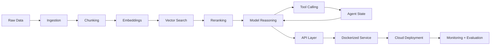

<div align="center">

# Zaafir Rizwan

### Building intelligent systems: agents, retrieval pipelines, automation, and production ML workflows

I build practical software that connects modern models with real data, tools, APIs, and deployment infrastructure.

[](https://linkedin.com/in/zaafir-rizwan)
[](mailto:zaafir.rizwan@gmail.com)
[](https://zaafir-rizwan.tech)

</div>

---

```txt
SYSTEM PROFILE
────────────────────────────────────────────
Name        Zaafir Rizwan
Focus       Agents · RAG · Automation · MLOps
Builds      Intelligent products from prototype to production
Stack       Python · LangGraph · FastAPI · Vector Search · Cloud
Signal      Open to serious AI/product engineering opportunities
────────────────────────────────────────────
```

## What I build

I work on the layer where **models, retrieval, automation, and backend systems** meet.

- **Agent workflows** with graph-based state, tool calling, memory, evaluation loops, and human review
- **Retrieval systems** for documents, logs, resumes, video, floor plans, and domain-specific knowledge
- **Automation products** that turn repetitive workflows into intelligent, API-driven systems
- **Production ML services** with clean APIs, containers, cloud deployment, and scalable infrastructure
- **Multimodal systems** that combine text, image, video, and structured data into useful workflows

---

## System architecture I care about



<div align="center">

**Data → retrieval → reasoning → tools → deployment → evaluation**

</div>

---

## Featured projects

| Project | What it proves | Stack |
| --- | --- | --- |
| [`mini-agentic-rag-system`](https://github.com/ZaafirRizwan/mini-agentic-rag-system) | Agentic retrieval workflow with structured reasoning and tool orchestration | LangGraph · RAG · Python |
| [`Building-Autonomous-AI-Agents-with-LangGraph`](https://github.com/ZaafirRizwan/Building-Autonomous-AI-Agents-with-LangGraph) | Autonomous agent patterns, graph state, and iterative workflows | LangGraph · LLMs · Agents |
| [`Rag_log_analysis`](https://github.com/ZaafirRizwan/Rag_log_analysis) | Retrieval-based analysis for logs, diagnostics, and operational insight | RAG · Vector Search · Python |
| [`local-rag`](https://github.com/ZaafirRizwan/local-rag) | Local-first private document question answering | Embeddings · Vector DB · Python |
| [`resume-fit`](https://github.com/ZaafirRizwan/resume-fit) | Resume matching and candidate scoring workflow | LLMs · FastAPI · Automation |
| [`video-understanding`](https://github.com/ZaafirRizwan/video-understanding) | Multimodal video analysis and scene understanding | Gemini · Computer Vision · Python |
| [`bim-agent`](https://github.com/ZaafirRizwan/bim-agent) | Agent concepts for BIM, floor plans, and built-environment workflows | Agents · Vision · Automation |

---

## Core strengths

### Agentic systems

I design workflows where models can plan, use tools, maintain state, critique outputs, and hand off to humans when needed.

`LangGraph` · `LangChain` · `Tool Calling` · `State Machines` · `Human-in-the-Loop` · `Evaluation`

### Retrieval and search

I build retrieval pipelines that make model outputs more grounded, relevant, and useful on private or domain-specific data.

`RAG` · `Embeddings` · `Vector Databases` · `Hybrid Search` · `Reranking` · `Document Ingestion`

### Backend and deployment

I care about the engineering around the model: APIs, jobs, containers, data contracts, observability, and reliable deployment.

`Python` · `FastAPI` · `PostgreSQL` · `Docker` · `AWS` · `GCP` · `GitHub Actions`

### Multimodal workflows

I work with systems that combine language, images, video, documents, and spatial data.

`Gemini` · `Computer Vision` · `OpenCV` · `Document AI` · `Video Understanding` · `Automation`

---

## Tech stack

<table>
  <tr>
    <td><strong>LLMs / Agents</strong></td>
    <td>LangGraph · LangChain · LlamaIndex · OpenAI · Gemini · Hugging Face</td>
  </tr>
  <tr>
    <td><strong>Retrieval</strong></td>
    <td>Pinecone · Weaviate · FAISS · embeddings · hybrid search · reranking</td>
  </tr>
  <tr>
    <td><strong>Backend</strong></td>
    <td>Python · FastAPI · PostgreSQL · REST APIs · background workers</td>
  </tr>
  <tr>
    <td><strong>ML / Vision</strong></td>
    <td>PyTorch · TensorFlow · scikit-learn · OpenCV · Grounding DINO</td>
  </tr>
  <tr>
    <td><strong>Cloud / MLOps</strong></td>
    <td>AWS · GCP · Docker · Kubernetes · Terraform · DVC · CI/CD</td>
  </tr>
</table>

---

## How I think

> Strong AI products are not just prompts. They are reliable systems with clean data flow, useful retrieval, evaluation, observability, guardrails, and deployment discipline.

I like building systems that are:

- useful beyond a demo
- grounded in real data
- measurable and testable
- built for latency, cost, and reliability
- designed so teams can trust them

---

## Current direction

- Agentic RAG systems
- AI workflow automation
- Multimodal document/video understanding
- Production patterns for AI-native applications
- Practical tools that reduce manual work

---

## Open to

- AI product engineering roles
- Generative AI / LLM application roles
- Applied ML engineering roles
- MLOps and ML infrastructure roles
- Startup teams building practical AI-native products
- Prototype-to-production consulting work

<div align="center">

### If you are building intelligent systems, let’s connect.

[](https://linkedin.com/in/zaafir-rizwan)
[](mailto:zaafir.rizwan@gmail.com)

<br />


</div>
